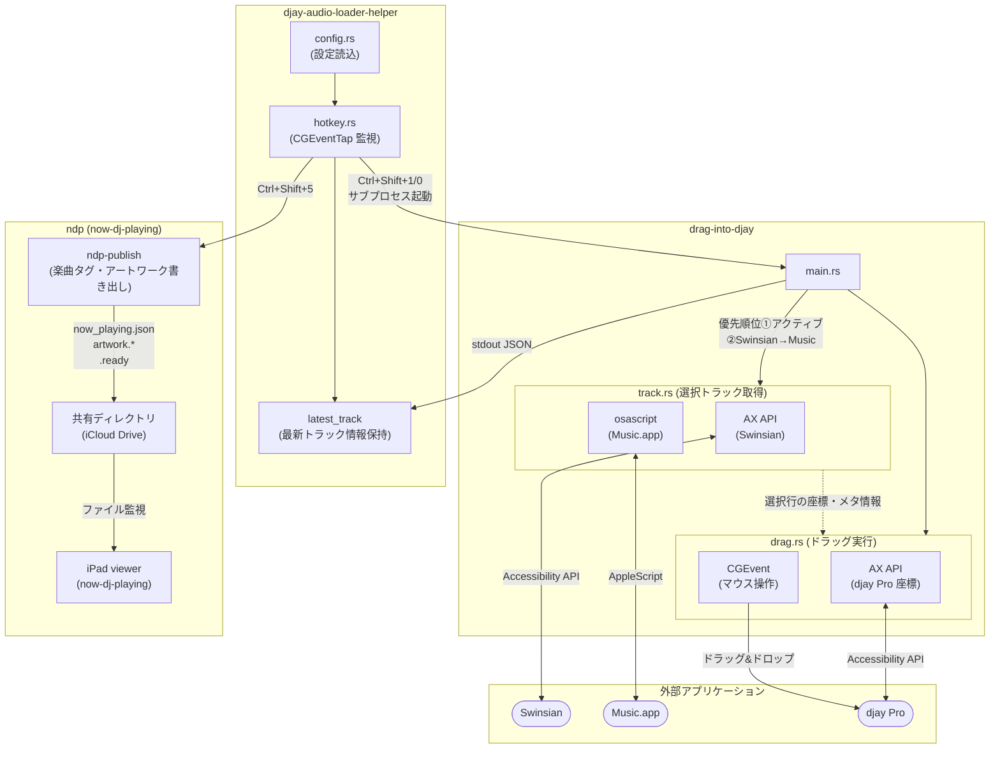

# djay-audio-loader

Swinsian または Music.app で選択中の楽曲を djay Pro の指定デッキにロードするツール群。

## アーキテクチャ



## ツール構成

| バイナリ | 役割 |
|---|---|
| `drag-into-djay` | 選択中トラックを djay Pro の指定デッキにドラッグ&ドロップでロードする CLI |
| `djay-audio-loader-helper` | グローバルホットキーを監視し `drag-into-djay` を呼び出すヘルパ |

## 前提条件

- macOS
- Swinsian または Music.app が起動済み
- djay Pro が起動済み・フォアグラウンド表示されていること
- **システム設定 > プライバシーとセキュリティ > アクセシビリティ** にて本ツールへの権限を付与済みであること

## ビルド

```sh
cargo build --release
```

生成されるバイナリ:

```
target/release/drag-into-djay
target/release/djay-audio-loader-helper
```

## 使い方

### drag-into-djay

Swinsian または Music.app で楽曲を選択した状態で実行する。

```sh
drag-into-djay -d <DECK_NO>
```

**オプション:**

| オプション | 説明 | デフォルト |
|---|---|---|
| `-d, --deck <DECK_NO>` | ロード先のデッキ番号 (1 or 2) | 必須 |
| `--drop-delay <MS>` | ドロップ前のホバー待機時間 [ms] | `250` |
| `--no-activate` | アプリのアクティブ化処理をスキップする | `false` |

**例:**

```sh
# デッキ1にロード
drag-into-djay -d 1

# デッキ2にロード（アクティブ化スキップ）
drag-into-djay -d 2 --no-activate
```

**動作:**

1. 以下の優先順位でアプリの選択中トラックを取得:
   1. Swinsian がアクティブ（フォアグラウンド）かつ選択中トラックあり
   2. Music.app がアクティブかつ選択中トラックあり
   3. Swinsian が起動中かつ選択中トラックあり（非アクティブ）
   4. Music.app が起動中かつ選択中トラックあり（非アクティブ）
2. djay Pro のウィンドウ座標を Accessibility API で動的取得
3. CGEvent でドラッグ&ドロップを実行

---

### djay-audio-loader-helper

グローバルホットキーを監視し、押下時に `drag-into-djay` を呼び出す。`Ctrl+C` で終了。

```sh
djay-audio-loader-helper [OPTIONS]
```

**オプション:**

| オプション | 説明 | デフォルト |
|---|---|---|
| `--no-activate` | `drag-into-djay` に `--no-activate` を渡す | `false` |
| `-D, --session-basedir <DIR>` | セッションログのベースディレクトリ | なし |
| `-S, --session-dir <DIR>` | セッションディレクトリを直接指定 | なし |
| `--ndp-publish <PATH>` | ndp-publish バイナリのフルパス（未指定時は NDP 機能無効） | なし |
| `--ndp-out <DIR>` | ndp-publish の出力先ベースディレクトリ（`--ndp-publish` 指定時は必須） | なし |
| `--ndp-dj-id <ID>` | ndp-publish の DJ ID | `dj-000` |
| `--ndp-dj-name <NAME>` | ndp-publish の DJ 名（テキスト or ロゴ画像パス） | なし |

**デフォルトホットキー:**

| ホットキー | 動作 |
|---|---|
| `Ctrl+Shift+1` | デッキ1にロード |
| `Ctrl+Shift+0` | デッキ2にロード |
| `Ctrl+Shift+5` | 最新のロード曲情報で ndp-publish を実行 |

**動作:**

- ホットキー押下時に `drag-into-djay` をサブプロセスとして起動
- ホットキーイベントは消費され、他のアプリには伝達されない
- `drag-into-djay` の実行中に再度ホットキーを押した場合はスキップ（多重起動防止）
- `djay-audio-loader-helper` と `drag-into-djay` は同じディレクトリに配置すること

#### NDP (Now DJ Playing) 連携

[now-dj-playing](https://github.com/issm/now-dj-playing) の `ndp-publish` CLI と連携し、再生中の楽曲情報をリアルタイムに viewer アプリへ共有する。

- `--ndp-publish` を指定すると NDP 機能が有効化される
- デッキへのロード成功時に helper が最新の楽曲情報を保持
- `Ctrl+Shift+5` で保持中の楽曲情報を基に ndp-publish を実行
- helper 起動時に出力先ディレクトリをクリンナップ（前回セッションの残存データを削除）

**例:**

```sh
djay-audio-loader-helper \
  --no-activate \
  --ndp-publish /path/to/ndp-publish \
  --ndp-out ~/Library/Mobile\ Documents/com~apple~CloudDocs/NowDJPlaying \
  --ndp-dj-id dj-issm \
  --ndp-dj-name "issm"
```
